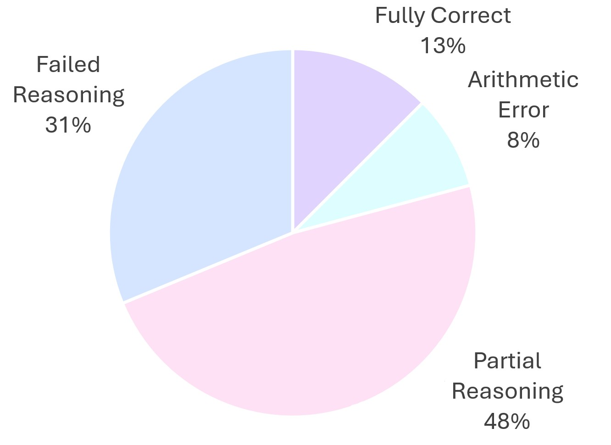

# Reasonix: Enhancing Base LLM Reasoning with CoT, SFT, and RLHF

This repository contains the code for our ECE324 project, a framework that improves the reasoning performance of LLMs on math tasks through a multi-stage pipeline involving Chain-of-Thought prompting, Reasoning Distillation, Supervised Fine-Tuning (SFT), and Reinforcement Learning with Human Feedback (RLHF).


## Task Description

While many LLM models excel at next-token prediction, but they often fail to follow logical steps required in math tasks.

The objective our project is to **improve LLMs' step-by-step reasoning ability**, enabling these models to:
- Generate consistent and structured thought processes
- Reduce logical errors
- Improve performance on GSM8K benchmark dataset


## Dataset Description

We use **GSM8K**, a benchmark dataset containing 8,800 grade school math problems.

- 7,500 training samples
- 1,300 test samples
- Each sample includes a word problem and a final numerical answer.
- We augment the training dataset using LLaMA 3.2 3B-Instruct to produce COT-structured step-by-step answer for each question.

For RLHF, we also use:
- **PRM800k**: a human-annotated dataset labeling individual reasoning steps as good, okay, or bad.


## Reasonix Development Pipeline

Our pipeline consists of the following key components:
1. **Few-shot Prompting**: Teach the model how to reason through examples.
2. **Reasoning Distillation**: Use a larger model to generate COT-structured training data.
3. **CoT Supervised Fine-Tuning (SFT)**: Fine-tune the baseline model using data of step-by-step solutions generated in the reasoning distillation step.
4. **RLHF with PPO**: Further align model outputs with human-preferred reasoning using Proximal Policy Optimization.


## Evaluation Metrics

We evaluate the models using:

1. **Accuracy** on GSM8K: % of final answers matching ground truth.
2. **Quality of Reasoning in Four Categories**:
   - Category 1: Fully correct reasoning and correct final answer  
   - Category 2: Correct reasoning and arithmetic error  
   - Category 3: Partial reasoning and wrong answer  
   - Category 4: Completely failed reasoning


## Results

### Baseline Performance




### Comparison between baseline and finetuned model


- **Baseline**: 16.8% accuracy and GSM8K, and 31% responses fell into Category 4, meaning the model completely failed to reason
- **After finetuning**: accuracy improved to **53.6%** on GSM8K, and the number of responses in Category 4 reduced to **18%** — finetuned model are more capable to reason now

### Sample Output Comparison


Top: Baseline model output (repeating steps without proceeding)  
Bottom: Fintuned model (structured CoT, correct answer)

## Code Structure

```text |   .gitattributes
|   .gitignore
|   env.yaml
|   LICENSE
|   README.md
|   structure.txt
|   
+---assets
|       barchart.png
|       improved_example.jpg
|       piechart.jpg
|       pipeline.png
|       
+---CoT
|       config.yaml
|       dataset.py
|       main.py
|       metrics.py
|       model.py
|       utils.py
|       
+---data
|       clean_data.py
|       config.yaml
|       dataset.py
|       gsm8k_train.jsonl
|       main.py
|       model.py
|       train.jsonl
|       utils.py
|       
+---inference
|   |   config.yaml
|   |   dataset.py
|   |   delay_run.sh
|   |   main.py
|   |   model.py
|   |   utils.py
|   |   
|   \---checkpoints
|       +---1B_3_5e-5_lora_gsm8k
|       |       outputs.txt
|       |       
|       +---1B_baseline_gsm8k
|       |       outputs.txt
|       |       
|       +---3B-instruct_baseline
|       |       outputs.txt
|       |       
|       +---3B-instruct_cot
|       |       outputs.txt
|       |       
|       +---3B_3_5e-05_base_gsm8k
|       |       outputs.txt
|       |       
|       +---3B_3_5e-05_lora_gsm8k
|       |       outputs.txt
|       |       
|       +---3B_baseline_gsm8k
|       |       outputs.txt
|       |       
|       +---3B_baseline_gsm8k_2
|       |       outputs.txt
|       |       
|       +---rlhf_policy_07_16-23
|       |       outputs.txt
|       |       
|       \---unknown_meta
|               outputs.txt
|               
\---RLHF
    |   config.yaml
    |   evaluate_reward_model.py
    |   main.py
    |   utils.py
    |   
    +---data
    |       prepare_prm_data.py
    |       test.jsonl
    |       train.jsonl
    |       
    +---policy_model
    |       data.py
    |       model.py
    |       train.py
    |       train_policy.py
    |       __init__.py
    |       
    \---reward_model
            data_loader.py
            model.py
            reward_model.py
            trainer.py
            __init__.py
            
```


## How to Run Code

_Coming soon... (code setup, training, inference instructions)_


## License

MIT License. See [LICENSE](./LICENSE) for details.
